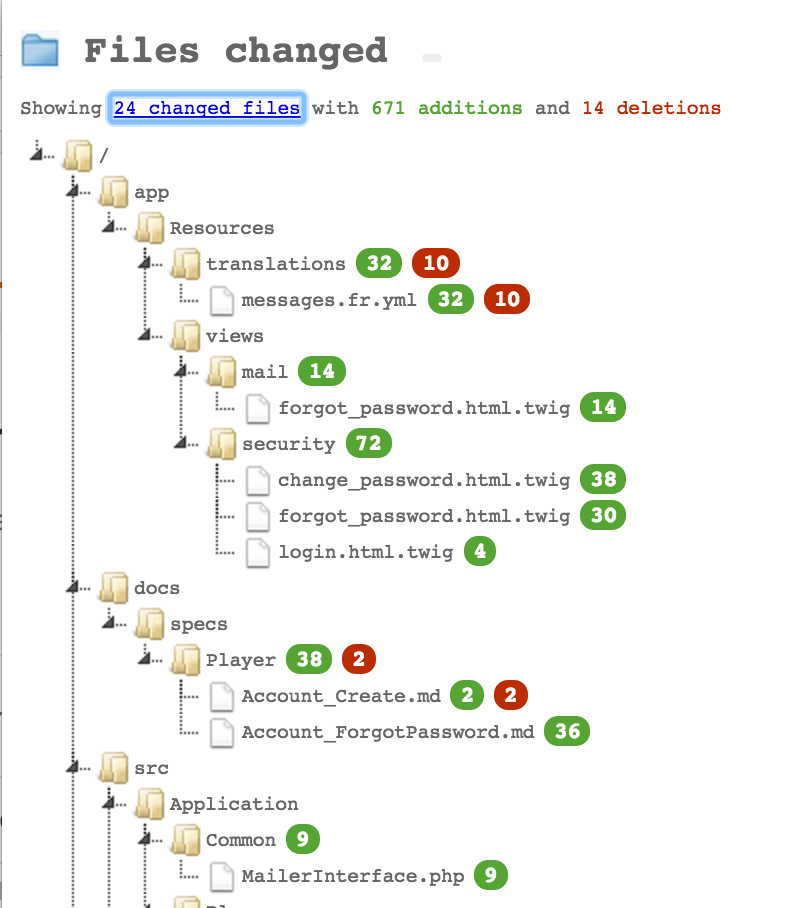

# Git's commit files as a TreeView (Chrome extension)

Adds a popup displaying committed files as a hierarchical directory view when visiting a Github's Pull Request or Commit detail page:

## ROADMAP & TODO's:

* Retrieve summary (files changed, removed lines, added lines) as structured data (to compute ratio of each committed file)
* Marking important change ratios
* Making the extension Gitlab-compliant
